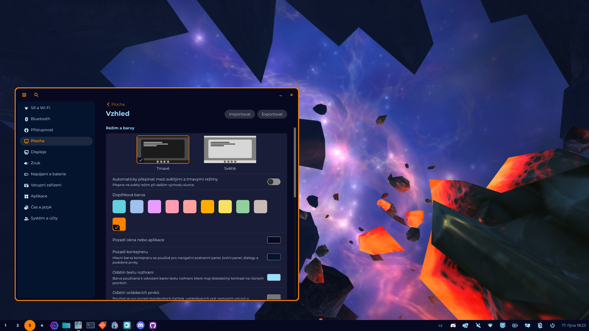
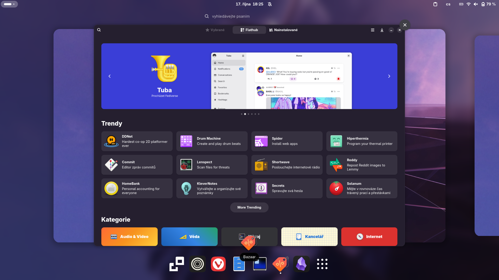
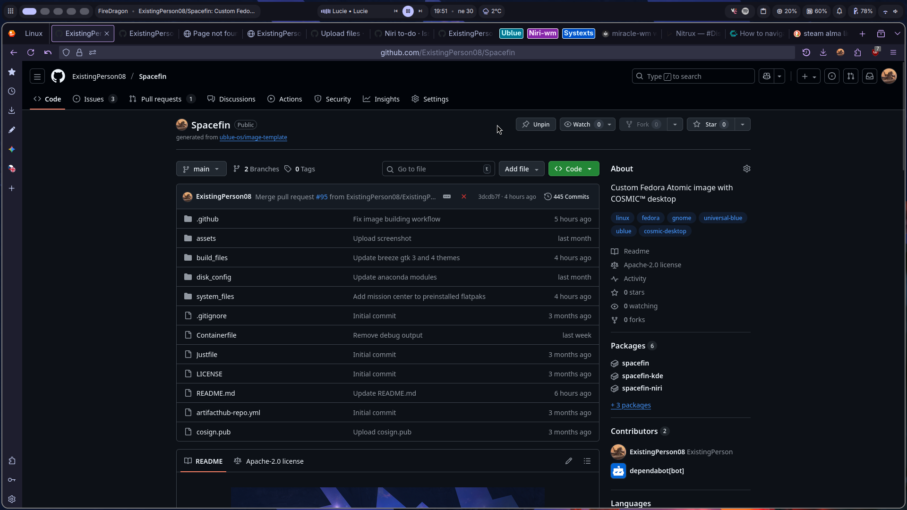

<div align="center">
 
</div>
<br>

Spacefin is my personal custom Fedora Atomic image with (not only) COSMIC desktop installed. 

## Features

 - Cosmic, Gnome or KDE desktops or Niri wm
 - Automatic updates in background
 - Codecs and drivers out-of-the box
 - Custom just commands
 - System76-schenduler enabled by default
 - Java preinstalled and set for running .jar files
 - Homebrew, Docker and Distrobox preinstalled
 - Restic and rclone out-of-the box
 - All shells (fish, bash, zsh) preinstalled

## Desktops

### Main (Cosmic)

 - Custom COSMIC theme
    - with focus on tilling and minimalism
 - Spacefin-cli for changing themes
 - Preconfigured Zed and VSCodium
 - Gnome Boxes and quickemu for virtualization
 - Curated set of open-source apps

If you want to install main eddition, rebase from Fedora Cosmic Atomic with:

```bash
sudo bootc switch --enforce-container-sigpolicy ghcr.io/existingperson08/spacefin-cosmic:latest
```

### GNOME

 - Preconfigured GNOME desktop
    - GSConnect set up by default
    - Layout customized for touchscreen
    - patches to enable fractional scalling, VRR and more
    - Preinstalled useful extensions
    - [Hanabi extension](https://github.com/jeffshee/gnome-ext-hanabi) for live wallpapers
 - Curated set of touchscreen-friendly open-source apps

If you want to install GNOME eddition, rebase from Fedora Silverblue or Bluefin with:

```bash
sudo bootc switch --enforce-container-sigpolicy ghcr.io/existingperson08/spacefin-gnome:latest
```

### Niri

 - Preconfigured Niri setup
    - [Dank material shell](https://danklinux.com/)
    - All needed packages preinstalled
    - Fingerprint unlock preconfigured
 - Easy to customize
 - Preconfigured Zed and VSCodium
 - Gnome Boxes and quickemu for virtualization

If you want to install Niri eddition, rebase from Fedora Silverblue or Bluefin with:

```bash
sudo bootc switch --enforce-container-sigpolicy ghcr.io/existingperson08/spacefin-niri:latest
```

### KDE

- Almost vanilla KDE 
- SteamOS themes
- Steam and lutris with Gamescope session
- VLC, Thunderbird and Edge for media
- Wine dobble-click to run .exe

If you want to install KDE eddition, rebase from Fedora Kinoite with:

```bash
sudo bootc switch --enforce-container-sigpolicy ghcr.io/existingperson08/spacefin-kde:latest
```

## Screenshots

<div align="center">

<br><br>

</div>
